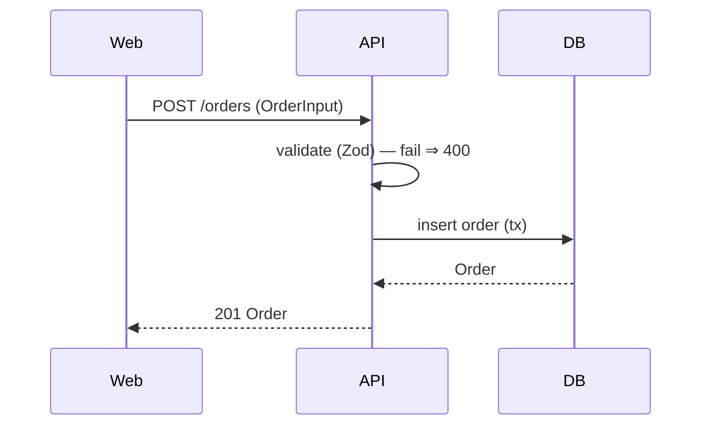

# flow-docs

The behavioral counterpart to `docs/architecture.md`. Structure tells an agent how packages are arranged; flows tell it how a request actually moves through them — the context most needed to change behavior without breaking it.

## What it produces

- `docs/flows/<flow-slug>.md` per documented path, each with a Mermaid sequence diagram and the supporting detail below.
- An index entry in `docs/flows/README.md` listing the documented flows.
- Optional nav update for `mkdocs` / `docusaurus` layouts.

Drafts in `.claudedocs/flows/`; promotion user-gated.

## Inputs

- `audit.json` — business-logic and integration findings name the candidate flows.
- `code-map.json` — resolves which symbols/modules participate and their call edges (greatly improves accuracy). Recommend running `code-map` first.
- `.repo-meta.yaml` — docs layout and package roles.
- The source, for the actual sequence.

## Phase 1 — Pick the flows

Propose candidate critical paths, ranked: user-facing entrypoints (HTTP routes, CLI commands, UI actions), auth/authorization, money/data-mutation paths, and anything the audit flagged as complex or risky. Let the user pick the top N (default 3–5). Don't try to document every path — flows are expensive and only the load-bearing ones earn a doc.

## Phase 2 — Trace each flow

For one flow, walk from entrypoint to terminal effect using `code-map.json` edges (or a direct trace if absent):

- **Participants** — the modules/services/external systems involved, in order.
- **Steps** — each hop: caller → callee, what's invoked, the data passed.
- **Data shape** — the key type/payload at each hop (name the type; link the anchor).
- **Branches** — significant conditionals (auth fail, validation fail, cache hit/miss).
- **Failure behavior** — what happens on error at each step: thrown, returned, retried, rolled back.
- **Invariants** — what must stay true across the flow (e.g. "an order is never persisted before payment authorizes").

Trace from real code; never infer a step that isn't there. Mark any uncertain hop explicitly.

## Phase 3 — Write the flow doc

```
# Flow: <human name>

**Entrypoint:** <route / command / handler> (<anchor>)
**Packages:** <list>
**Last verified:** <commit>

## Sequence


## Steps
1. <caller → callee> — <what> — data: `<Type>` (<anchor>)
...

## Failure & retry
- <step>: <behavior on error>

## Invariants
- <must-hold statement>

## Change notes for agents
- Touching <step> affects <downstream>. Update this doc if the sequence changes.
```

## Phase 4 — Diff, gate, index

Show each flow doc as a diff (full content if new), preserved regions untouched. On acceptance, write drafts, offer promotion, update `docs/flows/README.md` and any nav config. Record the `commit` as "last verified" so `documentation-check` can flag the flow as drifted when its participating files change.

## Edge cases and rules

- **No code-map.** Trace directly; slower and lower confidence on cross-package hops. Recommend `code-map` first for accuracy.
- **Flow crosses an external system** (payment provider, queue). Document the boundary contract (request/response shape, idempotency, retry policy); don't invent the third party's internals.
- **Async / event-driven flow.** Use a sequence diagram with async arrows; make the eventual-consistency points explicit (where the flow returns before the effect completes).
- **Flow too large to diagram cleanly.** Split into sub-flows with a parent index; don't produce an unreadable 40-participant diagram.
- **Uncertain step.** Mark it `(unverified)` in the doc rather than asserting it; offer to confirm with the user or a deeper trace.
- **Sensitive content.** Redact secrets/customer identifiers in payload examples; use obviously-fake values.

## Distinguishing from other skills

- **vs. `docs-author` (architecture.md)** — that documents structure (packages, boundaries, patterns). This documents behavior (sequences, data flow, failure). Complementary; flow docs link back to architecture.md.
- **vs. `code-map`** — that's the queryable symbol/edge index. This narrates a specific path through those edges into a human-readable sequence.
- **vs. `repo-audit`** — audit finds where the complex logic is; this explains how a chosen path works.

## What this skill never does

- Never documents a step that isn't in the code; uncertain hops are marked, not asserted.
- Never tries to document every path — only the chosen critical ones.
- Never modifies code.
- Never invents an external system's internal behavior.
- Never auto-promotes drafts.
